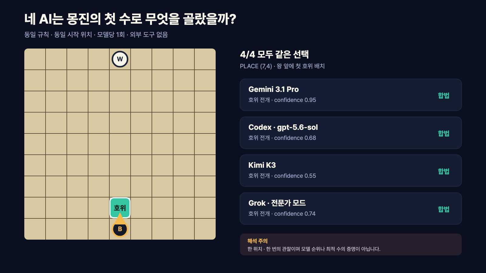

# Four AIs Saw Mongjin for the First Time. Would They Choose the Same Opening?

I am turning **Mongjin (蒙塵)**, an abstract strategy game I designed, into a
reproducible AI testbed. The first participants are Gemini, Codex, Kimi
K3, and Grok.

The first experiment deliberately avoids a complete match. Each model receives
the same rules, initial board, coordinate system, and six legal actions. With
search and external tools disabled, it must return one move and a short
strategic summary as JSON.

## Results

All four models returned a legal move—and all four chose the same one: place
Black's first guard directly in front of the king at `(7,4)`.

| Model surface | Opening | Strategy label | Confidence | Legal |
|---|---|---|---:|---:|
| Gemini 3.1 Pro | Place guard at `(7,4)` | guard development | 0.95 | yes |
| Codex `gpt-5.6-sol` | Place guard at `(7,4)` | guard development | 0.68 | yes |
| Kimi K3 | Place guard at `(7,4)` | guard development | 0.55 | yes |
| Grok Expert | Place guard at `(7,4)` | guard development | 0.74 | yes |

The legal move rate was **4/4 (100%)**. Their short explanations converged on
the same intuition: build protection and a future placement base before
exposing the king. Their self-reported confidence still ranged from 0.55 to
0.95.

I recorded wall time but do not use it to compare speed. Gemini and Grok ran
through subscription web interfaces, while Codex and Kimi used
subscription-authenticated CLIs.

The exact prompt, raw JSON responses, and normalized records are preserved in
the source experiment.

This is one sample from one position. It tests initial rule comprehension and
interface reliability; it does not rank general intelligence or Mongjin skill.

The unanimity creates a better follow-up question: is guard development
actually strong, or did the way I presented the rules and candidates guide all
four systems toward the same intuition? Next I will remove the explicit move
list or test repeated midgame positions, then let the audience choose an agent
for a complete game against the deterministic Greedy baseline.
